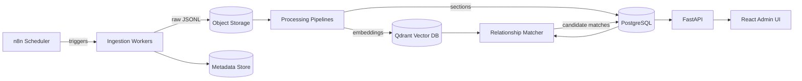

# Architecture Overview

The system is organized into modular services that can scale independently. Ingestion,
processing, and relationship discovery can run as asynchronous workers or scheduled jobs.
